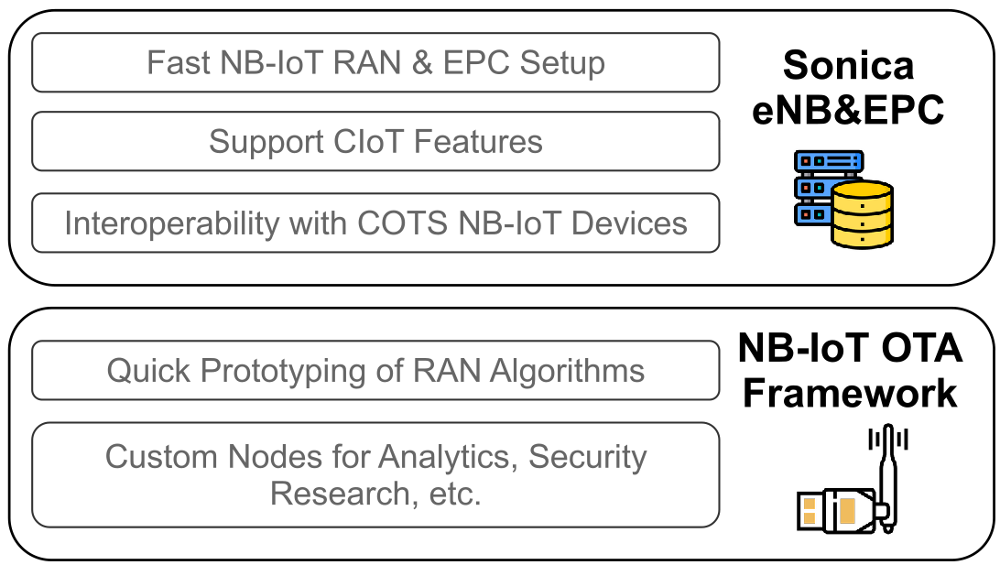

# Sonica: Software-defined Open NB-IoT Research Platform

## Introduction

Sonica provides an open-source NB-IoT testbed that is able to communicate with commodity off-the-shelf (COTS) devices.
It implements NB-IoT version of eNodeB and an EPC with Cellular
Internet-of-Things (CIoT) extensions.
Thus it provides a platform for quick prototyping and/or verification
on various layers of the NB-IoT network.



## System Setup

Sonica runs on Linux environment. To set up a NB-IoT network that can
communicate with COTS hardware, SDR RF hardware is necessary. The currently
tested hardware include USRP B210 and X300.

Before building, you need to install dependencies packages. For example,
on Ubuntu, the command is:

```sh
$ sudo apt-get install build-essential cmake libfftw3-dev \
   libmbedtls-dev libboost-program-options-dev libconfig++-dev \
   libsctp-dev
```

Besides, UHD (for communication with USRP) and ZeroMQ (for RF emulation)
is also required.

Sonica's build system is based on [Meson](https://mesonbuild.com/).
To build, execute the following commands:

```sh
[sonica]$ meson builddir
[sonica]$ cd builddir
[sonica/builddir]$ meson compile
```

The two binary programs are located within 'builddir' directory:
* eNodeB: `sonica_enb/sonica_enb`
* EPC: `third_party/srsepc_ciot/src/srsepc_ciot`

For more details, see our [documentation](https://dboyan.github.io/sonica-doc/).

## Join the Community
If you have any technical issue, please go to [Issues](https://github.com/sonica-nbiot/sonica/issues).
For any other question, please contact <sonica.iotproject@gmail.com>.

## License

Sonica is licensed under AGPL 3.0. For the third party software used,
the licensing information is listed in the `third_party` directory.
